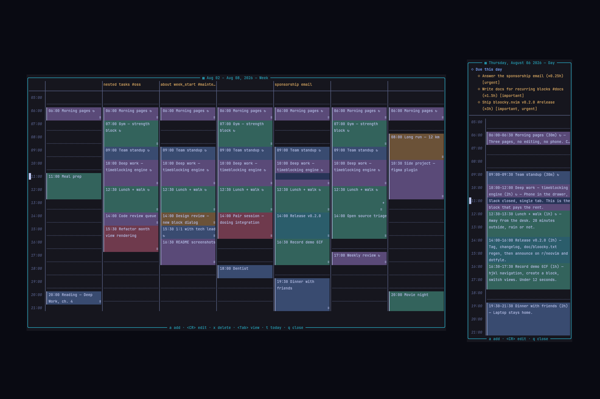

# Bloocky

A timeblocking calendar for Neovim. Plan your day by placing time blocks on a calendar with **day**, **week** and **month** views, navigate everything with `hjkl`, and optionally bring your [dooing](https://github.com/atiladefreitas/dooing) tasks straight onto the calendar.



---

## 🚀 Features

- 📅 **Three views** — full month calendar, week grid with hour rows, and a detailed day view
- 🧭 **`hjkl` navigation** — move across days and hours; `H`/`L` jump a whole month or week
- 🧱 **Time blocks** — give an action a start time and a duration, and see it spread over the grid as a colored block
- 🔁 **Recurring blocks** — daily, weekly, weekdays (Mon–Fri) or a custom set of days, with an optional end date
- 🗨️ **Creation dialog** — a floating form with inline hints; blocks snap to a configurable granularity (30 min by default)
- ✅ **Dooing integration** — opt-in, read-only: your dooing todos show up on their due date with estimate and priorities, without ever touching dooing's data
- 🕐 **Configurable working hours** — decide which hour your day starts and ends, and whether the week starts on Sunday or Monday
- 💾 **Automatic persistence** — blocks are saved to a JSON file on every change

---

## 📦 Installation

### Prerequisites

- Neovim `>= 0.10.0`
- A [Nerd Font](https://www.nerdfonts.com/) for the icons (optional, icons are configurable)

### Using Lazy.nvim

```lua
{
    "atiladefreitas/bloocky.nvim",
    config = function()
        require("bloocky").setup({
            -- your custom config here (optional)
        })
    end,
}
```

---

## ⚙️ Configuration

### Default Configuration

```lua
{
    -- Where time blocks are persisted
    save_path = vim.fn.stdpath("data") .. "/bloocky_blocks.json",

    -- View shown when the calendar opens: "day" | "week" | "month"
    default_view = "week",

    -- First day of the week: "sunday" | "monday"
    week_start = "sunday",

    -- Visible hour range in the day and week views
    hours = {
        start = 5,     -- first hour shown (05:00)
        ["end"] = 22,  -- last hour shown (22:00)
    },

    -- Block start/duration are snapped to this many minutes
    granularity = 30,

    window = {
        -- Width per view: fraction of the editor width (or absolute columns if > 1).
        -- A single number applies to every view.
        width = {
            month = 0.8,
            week = 0.6,
            day = 46,
        },
        border = "rounded",
    },

    icons = {
        block = "▎",
        dooing = "◆",
        recurring = "󰑖",
    },

    -- Bring tasks from other plugins into the calendar
    integrations = {
        dooing = {
            enabled = false,   -- show dooing.nvim todos on their due date
            show_done = false, -- also show completed todos
        },
    },

    keymaps = {
        -- Global
        toggle = "<leader>tb",

        -- Inside the calendar window
        calendar = {
            nav_left = "h",
            nav_down = "j",
            nav_up = "k",
            nav_right = "l",
            prev_period = "H", -- previous month/week (depends on view)
            next_period = "L", -- next month/week
            view_day = "gd",
            view_week = "gw",
            view_month = "gm",
            cycle_view = "<Tab>",
            today = "t",
            add = "a",
            edit = "<CR>",
            delete = "x",
            close = "q",
        },
    },
}
```

---

## 🔑 Default Keybindings

### Global

| Key          | Action              |
| ------------ | ------------------- |
| `<leader>tb` | Toggle the calendar |

### Inside the calendar

| Key            | Action                                              |
| -------------- | --------------------------------------------------- |
| `h` / `l`      | Previous / next day                                 |
| `j` / `k`      | Next / previous hour (week/day) or week (month)     |
| `H` / `L`      | Previous / next month (month view) or week          |
| `gd` `gw` `gm` | Switch to day / week / month view                   |
| `<Tab>`        | Cycle through the views                             |
| `t`            | Jump to today                                       |
| `a`            | Create a block at the cursor slot                   |
| `<CR>`         | Edit the block under the cursor (or create one)     |
| `x`            | Delete the block under the cursor                   |
| `q` / `<Esc>`  | Close the calendar                                  |

### Inside the block dialog

| Key               | Action                                        |
| ----------------- | --------------------------------------------- |
| `<Tab>` / `<S-Tab>` | Next / previous field                       |
| `<CR>` (insert)   | Next field (saves from the last one)          |
| `<CR>` (normal)   | Save                                          |
| `<C-s>`           | Save                                          |
| `j` / `k`         | Move between fields                           |
| `dd`              | Clear the current field                       |
| `q` / `<Esc>`     | Cancel                                        |

Invalid fields are marked inline with the reason — fix them and save again.

---

## 📝 Commands

- `:Bloocky [day|week|month]` — open the calendar (optionally in a specific view)
- `:BloockyToggle` — toggle the calendar
- `:BloockyAdd` — open the calendar and jump straight into the creation dialog

---

## 🔧 Usage

1. Open the calendar with `<leader>tb` (or `:Bloocky`)
2. Move around with `hjkl`; the highlighted slot is your cursor
3. Press `a` (or `<CR>` on an empty slot) to open the block dialog
4. Fill in the fields — `Duration` accepts `1h30m`, `45m`, `2h`, `90`; set `Repeat` to `daily`, `weekly`, `weekdays` or `custom` (with `Days: mon,wed,fri`) and an optional `Until` date for recurring blocks
5. Save with `<CR>`, and watch the block spread over its hours on the grid
6. `<CR>` on an existing block edits it, `x` deletes it (recurring blocks delete the whole series)

---

## ✅ Dooing integration

If you use [dooing](https://github.com/atiladefreitas/dooing), enable the integration to see your todos on the calendar:

```lua
require("bloocky").setup({
    integrations = {
        dooing = {
            enabled = true,
        },
    },
})
```

Todos with a due date appear on their due day — in the month view as `◆` entries, in the week view as a `due` strip above the grid, and in the day view as a section listing the time estimate and priorities. Overdue todos are highlighted in red. The integration is **read-only**: bloocky never modifies dooing's data.

---

## 🎨 Customization

### Working hours and week start

```lua
require("bloocky").setup({
    week_start = "monday",
    hours = { start = 8, ["end"] = 18 },
})
```

### Highlight groups

All groups are defined with `default = true`, so you can override them in your colorscheme:

`BloockyHeader`, `BloockyTime`, `BloockyGrid`, `BloockyToday`, `BloockyCursor`, `BloockyOtherMonth`, `BloockyMore`, `BloockyDooing`, `BloockyDooingDone`, `BloockyDooingOverdue`, and the block palette `BloockyBlock1` … `BloockyBlock6`.

```lua
vim.api.nvim_set_hl(0, "BloockyBlock1", { fg = "#ffffff", bg = "#005f87" })
vim.api.nvim_set_hl(0, "BloockyToday", { fg = "#ff9e64", bold = true })
```

---

## 📄 License

This project is licensed under the MIT License — see the [LICENSE](LICENSE) file for details.

## 🤝 Contributing

Contributions are welcome! Feel free to open issues or submit pull requests.

---

Made with ❤️ for the Neovim community. If you find any issues or have suggestions, reach out at contact@atiladefreitas.com
